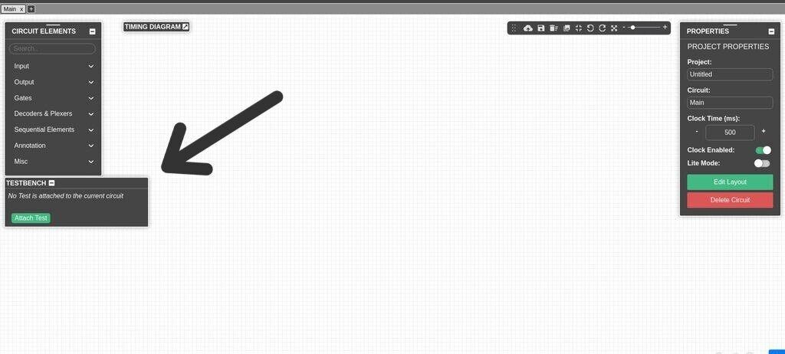
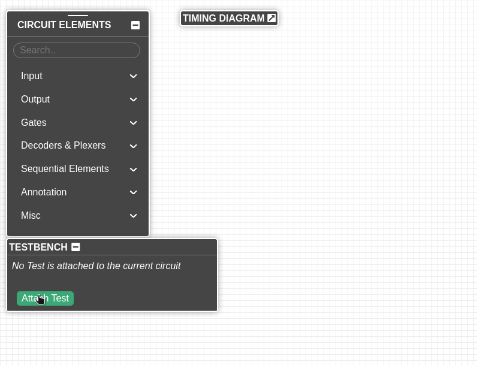
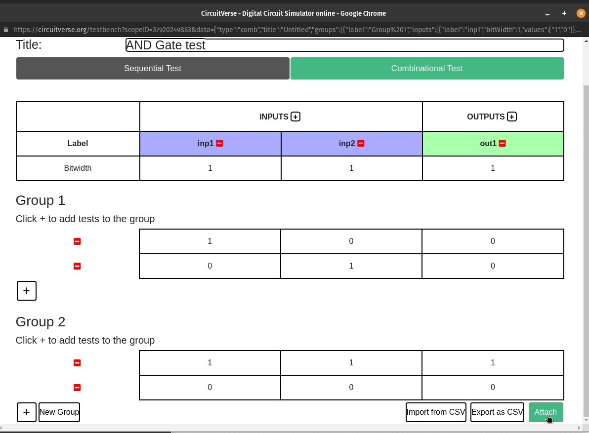
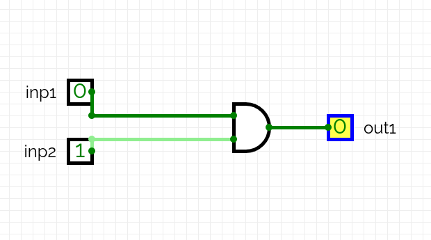
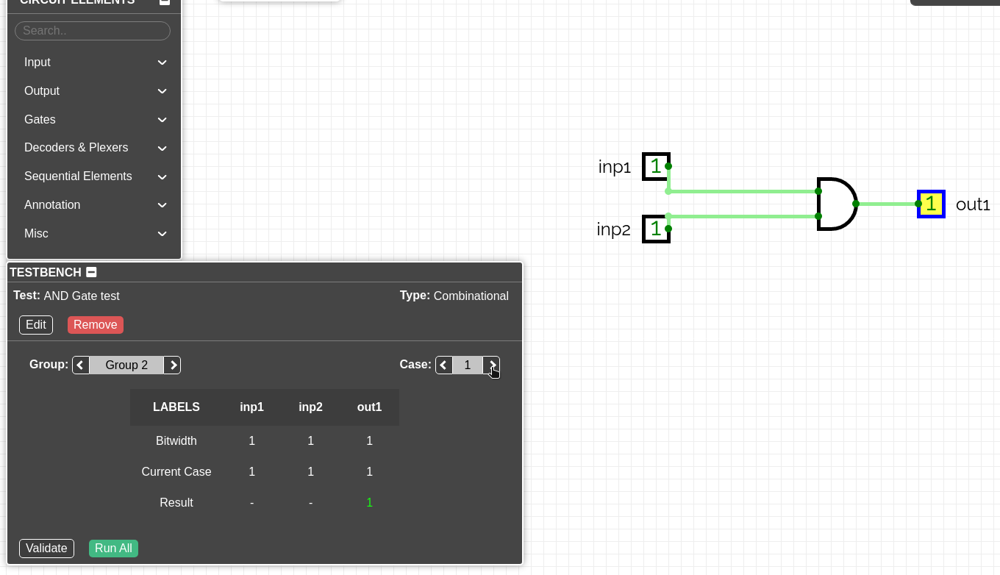
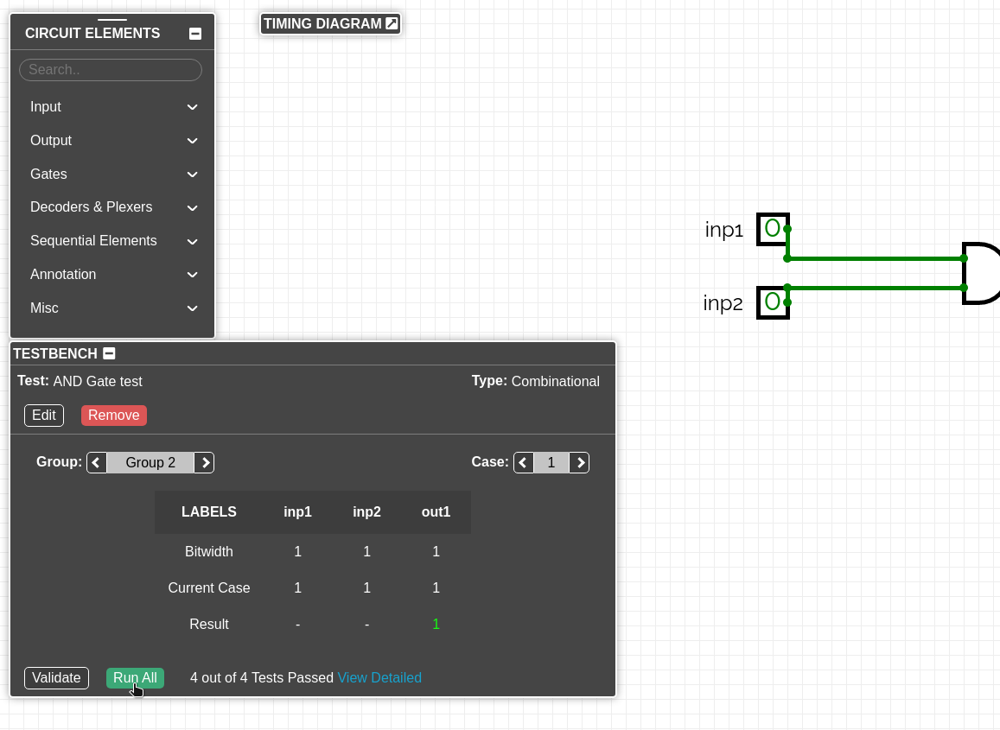
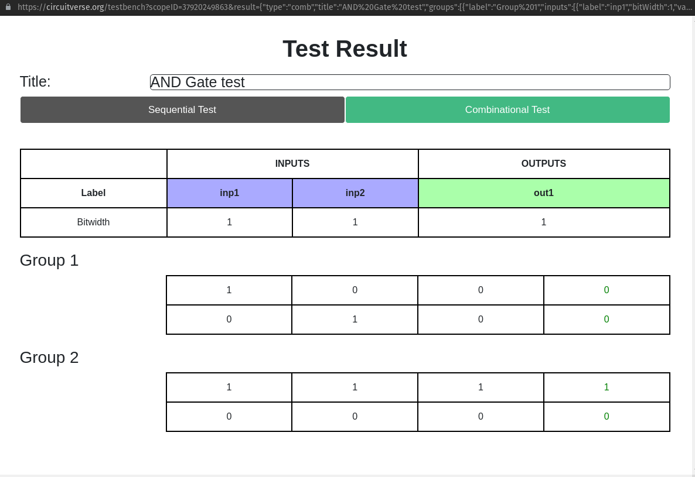

# Testing CircuitVerse circuits

The Testbench helps you test your circuits in the simulator itself

### It's here in this corner

### Attach a test to a circuit
Each circuit in a project can be attached a test, this test is saved along with your circuits. So the next time you load your circuit, the test loads with it.

### Create the test using the test creator
The test creator provides an intuitive UI to create tests.
 - Select the type of test - `Sequential` or `Combinational`
 - Add inputs / outputs by clicking the `+` icon next to `INPUTS` / `OUTPUTS` label.
 - Add another test to the group by clicking `+` icon below
 - Add another group by clicking `New Group`

For sequential tests, clock is ticked between each Group. For combinational tests, Groups are just a logical separation between different types of tests.

Alternatively, you can also export the created test as CSV and edit it. You can import this CSV to attach by clicking `Import from CSV`

Finally,
 - Save and attach the test by clicking `Attach`

### Label your circuit elements
The testbench uses the element labels to identify Input and Output elements. So make sure they are labelled the same as that in the tests.

Click `Validate` to make sure you have added all elements properly

### Ready to go!
Click the arrows next to Group / Test number to scroll through and run tests

Click `Run All` to run all the tests in an instant

And get detailed results!

### TB Input and TB Output

Once a test is attached to a circuit, CircuitVerse automatically generates **TB Input** and **TB Output** blocks on the canvas for each labelled Input/Output element used in the test.

**TB Input** displays:
- The TestBench name
- Whether the test is actively running
- The current test case number

**TB Output** displays:
- The TestBench name
- Whether it is Paired or Unpaired

> Properties that can be customized in the **PROPERTIES** panel include: **TestBench Name, Reset Iterations, Toggle State** (for TB Input) and **TestBench Name** (for TB Output)

A TB_Output block shows **"Paired"** when it finds a matching TB_Input with the same identifier — this is separate from whether your test's output label actually matches a real Output element in your circuit. Use the **Validate** button to confirm your circuit elements are correctly matched, since TB_Output can show "Paired" even when circuit validation reports a mismatch. Selecting either block highlights it in yellow, same as any other circuit element.

You can verify this behavior in the live circuit embedded below:

<iframe
  width="600"
  height="400"
  src="https://circuitverse.org/simulator/embed/tb-input-output-demo"
  title="TB Input and TB Output demo"
  id="projectPreview"
  scrolling="no"
  webkitAllowFullScreen
  mozAllowFullScreen
  allowFullScreen
>
  {" "}
</iframe>