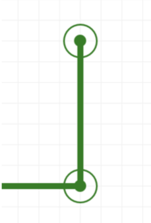
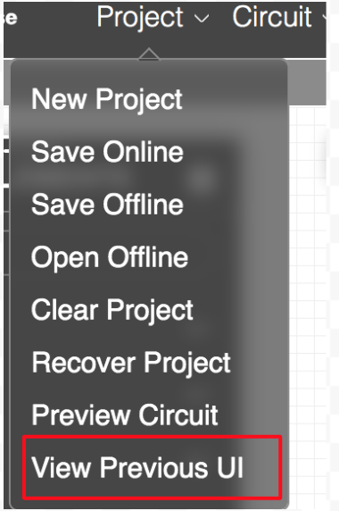

# Verilog Support in CircuitVerse

In addition to providing a graphical interface for designing digital circuits, CircuitVerse also supports **Verilog**, a popular hardware description language (HDL) used to model, simulate, and verify digital systems.

CircuitVerse provides two Verilog-related features:

- [Circuit to Verilog Code](#circuit-to-verilog-code)
  - [Steps to Convert Circuit to Verilog Code](#steps-to-convert-circuit-to-verilog-code)
  - [Features and Verilog Constructs Provided by CircuitVerse](#features-and-verilog-constructs-provided-by-circuitverse)
  - [Example](#example)
- [Verilog Code to Circuit](2verilogtocircuit.md)

---

## Circuit to Verilog Code

CircuitVerse allows users to convert graphical circuits into Verilog code. The generated code can be exported and simulated using external Verilog simulators such as **EDA Playground**.

> **Note:** CircuitVerse does not generate FPGA bitstreams. If the generated Verilog code is intended for FPGA implementation, it must be synthesized and processed using appropriate FPGA toolchains (e.g., Quartus, Vivado), and compatibility is not guaranteed.

---

## Steps to Convert Circuit to Verilog Code

### 1. Design Your Circuit
Create your digital circuit using the CircuitVerse online simulator. Ensure that your circuit is complete and functions as expected before exporting.

### 2. Access the Verilog Conversion Tool
- Click on the **"Tools"** menu located at the top of the CircuitVerse interface.
- Select the **"Export Verilog"** option from the dropdown menu (Refer to Figure 8.1).



<div align="center"><em>Figure 8.1</em></div>

### 3. Label Inputs and Outputs
Assign labels to input, output, and other elements in your circuit. These labels are used as signal names in the generated Verilog code, improving readability and debugging.

### 4. Generate Verilog Code
- A new window will open displaying the generated Verilog module.
- A testbench template is also generated (commented out).
- Review the generated code carefully to ensure it correctly represents your circuit (Refer to Figure 8.2).



<div align="center"><em>Figure 8.2</em></div>

> **Note:** Verilog support in CircuitVerse is an experimental feature. In certain cases, the generated code may require manual corrections.

### 5. Download or Copy the Code
- You may download the Verilog file (`.v`) or copy the generated code directly.
- Use the code in your preferred Verilog simulator.
- **EDA Playground** is recommended, using **Icarus Verilog** as the simulation engine.

### 6. Testbench Generation
The Verilog export window includes a commented testbench template. Users must manually provide stimulus values and complete the testbench before simulation.

---

## Features and Verilog Constructs Provided by CircuitVerse

CircuitVerse supports generation of the following Verilog constructs:

- **Primitive Gates:** AND, OR, NOT, NAND, NOR, XOR, and XNOR.
- **Sequential Elements:** Flip-flops and latches.
- **Higher-Level Components:** RAM, ROM, ALU, and other composite elements are translated into corresponding Verilog representations.
- **Structural (Gate-Level Style) Code:** CircuitVerse primarily generates structural Verilog using continuous assignments and module instantiations.
- **Subcircuits as Modules:** Each subcircuit is converted into a separate Verilog module, which is instantiated within the main module.

> CircuitVerse primarily generates structural Verilog. Advanced behavioral constructs (e.g., complex FSM descriptions) are not automatically synthesized from graphical circuits.

---

## Example

Below is a simple example of an AND gate circuit and its corresponding generated Verilog code.

### Circuit Design

<iframe src="https://circuitverse.org/simulator/embed/andvk?theme=&display_title=false&clock_time=true&fullscreen=true&zoom_in_out=true"
style="border-width:0;"
name="myiframe"
id="projectPreview"
scrolling="no"
frameborder="1"
marginheight="0px"
marginwidth="0px"
height="500"
width="500"
allowFullScreen>
</iframe>

### Generated Verilog Code

```verilog
module Main(out1, inp1, inp2);
  output out1;
  input inp1, inp2;
  wire and_0_out;

  assign and_0_out = inp1 & inp2;
  assign out1 = and_0_out;

endmodule