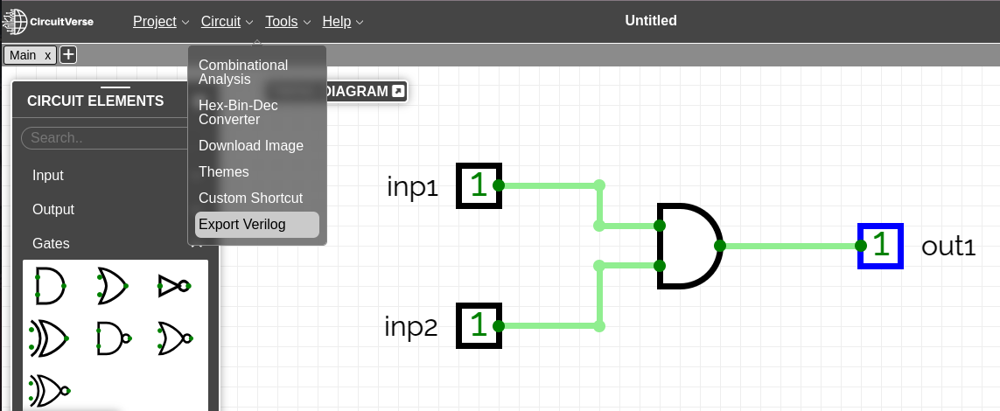
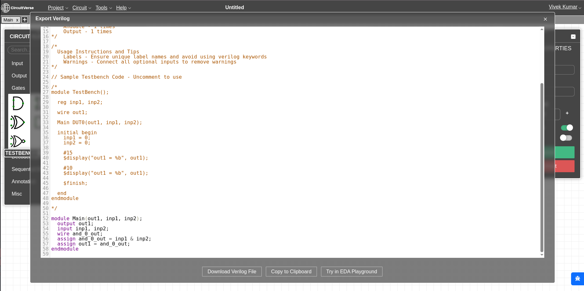

# Verilog support in CircuitVerse

CircuitVerse together with providing a graphical interface for designing circuits, it also supports Verilog which is a popular hardware description languages which allows the users to simulate hardware and test them. CircuitVerse provides two types of verilog features:

  - [Circuit to Verilog code](#Circuit-to-Verilog-code)
    - [Steps to Convert Circuit to Verilog Code](#Steps-to-Convert-Circuit-to-Verilog-Code)
    - [Features and Verilog construct provided by Circuitverse](#Features-and-Verilog-construct-provided-by-Circuitverse)
    - [Example](#Example)
  - [Verilog code to Circuit](#2verilogtocircuit.md)

## Circuit to Verilog code
CircuitVerse allows users to convert graphical circuits into Verilog code and export them to be run by different verilog simulators like EDA playground and reconfigurable integrated circuits like FPGAs (NOTE: CV doesn't generate bitstreams for hardware).

## Steps to Convert Circuit to Verilog Code

1. **Design Your Circuit**: Create your digital circuit using the CircuitVerse online simulator. Ensure that your circuit is complete and functions as expected.

2. **Access the Verilog Conversion Tool**:
    - Once your circuit is ready, click on the **"Tools"** menu located at the top of the CircuitVerse interface.
    - Select the **"Export Verilog"** option from the dropdown menu. Refer Figure 8.1.

    

    <div align="center"><em>Figure 8.1</em></div>

3. **Give labels to your input and output elements**:
    - You can give your input, output and elements labels to name them respectively in generated verilog code. This also helps in debugging the code. 

4. **Generate Verilog Code**:
    - A new window will appear displaying the Verilog code and testbench(commented) generated from your circuit.
    - Review the generated code to ensure it accurately represents your circuit design. Refer Figure 8.2.

    

    <div align="center"><em>Figure 8.2</em></div>

    > NOTE: Verilog support is an experimental feature in CV so, in some cases it can generate wrong verilog code.

5. **Download or Copy the Code**:
    - You can either download the Verilog code as a `.v` file or copy the code directly from the window.
    - Use the downloaded or copied code in your preferred Verilog simulator or integrate it into your existing Verilog projects.
    - EDA playground is suggested as simulator to run the generated verilog module (Icarus verilog is the supported version).

6. **Testbench code generated**:
    - The verilog window also contains testbench for the generated verilog module generated but is commented out, it is not filled with the sample values and the user need to enter it manually.

## Features and Verilog construct provided by Circuitverse
CircuitVerse supports a variety of Verilog constructs, including:

- **Primitive Gates**: Basic logic gates like AND, OR, NOT, NAND, NOR, XOR, and XNOR can be defined using Verilog.
- **Sequential elements**: Sequential elements like flip-flops, latches, RAM, ROM, ALU etc can be defined using Verilog.
- **Gate-Level and Behavioral Code**: CV supports generating Verilog code at both gate and behavioral levels, depending on circuit complexity .
- **Verilog Module Instantiations and Subcircuits**: Each subcircuit in CircuitVerse is converted into a separate Verilog module which is then instantiated in the main module.

## Example

Here is a simple example of a AND Gate circuit and its corresponding Verilog code:

### Circuit Design

<iframe src="https://circuitverse.org/simulator/embed/andvk?theme=&display_title=false&clock_time=true&fullscreen=true&zoom_in_out=true" style="border-width:; border-style: ; border-color:;" name="myiframe" id="projectPreview" scrolling="no" frameborder="1" marginheight="0px" marginwidth="0px" height="500" width="500" allowFullScreen></iframe>

### Generated Verilog Code

```verilog
module Main(out1, inp1, inp2);
  output out1;
  input inp1, inp2;
  wire and_0_out;
  assign and_0_out = inp1 & inp2;
  assign out1 = and_0_out;
endmodule
```


> TIP: By following these steps, you can efficiently convert your CircuitVerse designs into Verilog code, integrate it into your verilog project and do further simulation and integration into your digital design workflow. The generated verilog code can be also used in reconfigured circuit boards like FPGAs to simulate the hardware.
