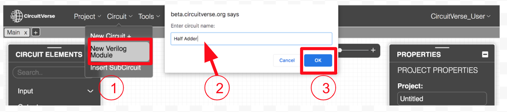
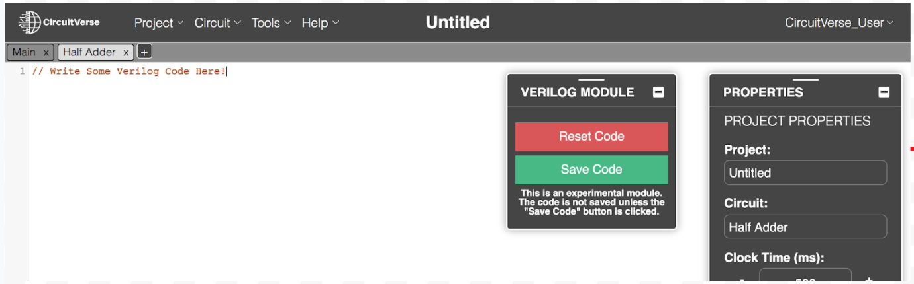
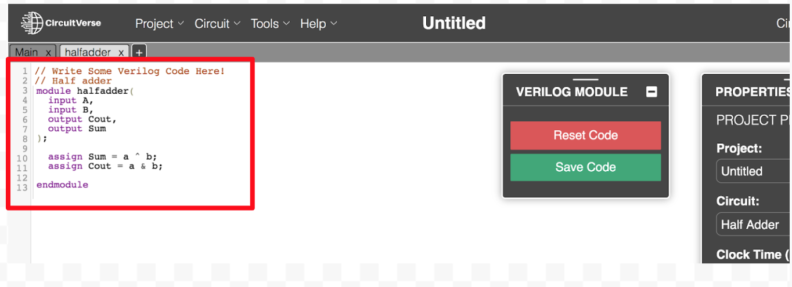
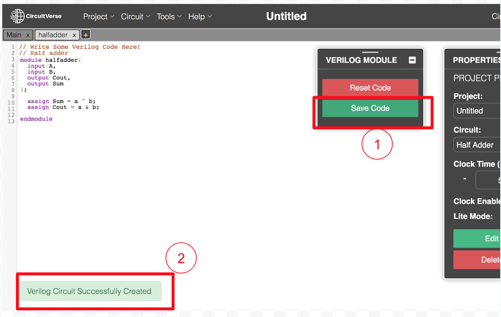
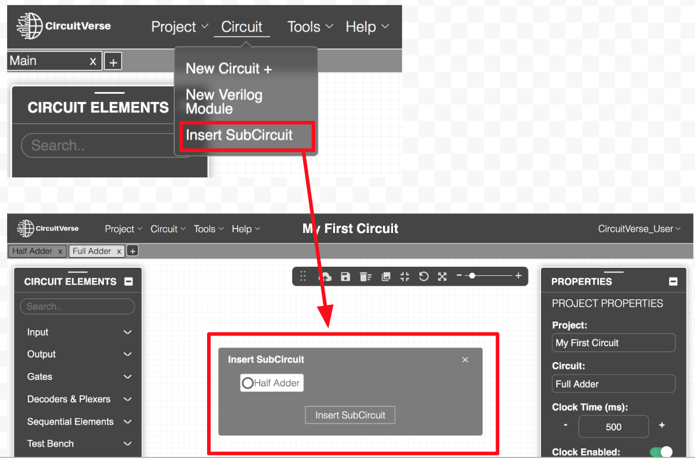
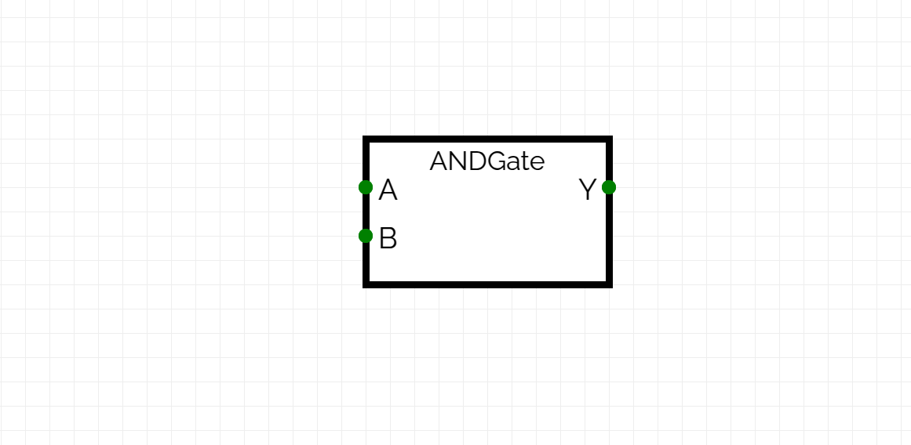
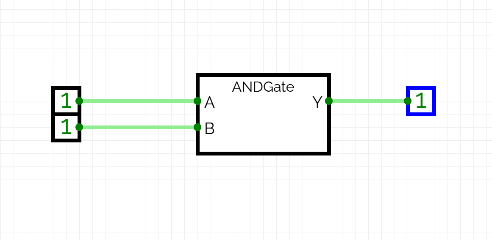

# Verilog Code to Circuit

CircuitVerse allows you to convert Verilog code into a circuits. This feature is useful for those who prefer writing hardware descriptions in Verilog and want to visualize the corresponding circuit by simulating it in CiruitVerse Simulator.

## Steps to Convert Verilog Code to Circuit

1. **Access the Verilog Editor**:
Navigate to **Circuit** drop-down menu to select **New Verilog Module** from the drop down menu. As shown in Figure 8.3, the **Enter circuit name** pop up window is displayed.

    

    <div align="center"><em>Figure 8.3</em></div>

2. Enter a circuit tab name in the text field. Refer Figure 8.3.

3. Click **OK **to launch the Verilog code interface window as shown in Figure 8.4.

    

    <div align="center"><em>Figure 8.4</em></div>

4. **Write or Paste Verilog Code**:
Enter the desired Verilog code in the module interface. Refer Figure 8.5.

   

   <div align="center"><em>Figure 8.5</em></div>

5. Click on the **Save Code** button to receive the message that the code has been saved successfully. Refer Figure 8.6.

   

   <div align="center"><em>Figure 8.6</em></div>

6. Navigate to **Circuit** drop-down menu to select **Insert SubCircuit** from the drop down menu. As shown in Figure 8.7, the **Insert SubCircuit** pop up window is displayed. Select your verilog-module name and click on **Insert SubCircuit** button.

   

   <div align="center"><em>Figure 8.7</em></div>

7. The verilog module will be inserted as box with name of verilog module and defined input and output ports in the simulator. Refer Figure 8.8.

   

   <div align="center"><em>Figure 8.8</em></div>

7. **Verify and Simulate**:
    - Verify the generated circuit by checking the connections and components.
    - Use the simulation tools in CircuitVerse to test the functionality of the circuit.

## Example

Here is a simple example of Verilog code for a 2-input AND gate:

```verilog
module ANDGate (
     input A,
     input B,
     output Y
);
assign Y = A & B;
endmodule
```

   

   <div align="center"><em>Figure 8.9</em></div>

After compiling and generating the circuit, you should see a circuit with two inputs (A and B) and one output (Y) representing the AND gate. Add the input and output to the circuit as shown above in fig 8.9 above.

## Tips and Warning

- The V2C generator does not support all the verilog constructs, so it might fail to generate circuit for some verilog code.
- Ensure that your Verilog code is well-commented to make it easier to understand and debug.
- Use meaningful names for inputs, outputs, and internal signals and use proper data-types to avoid mistakes.
- Avoid using verilog constructs like file I/O.

By following these steps, you can easily convert Verilog code into a digital circuit using CircuitVerse, allowing for better visualization and testing of your hardware designs.
