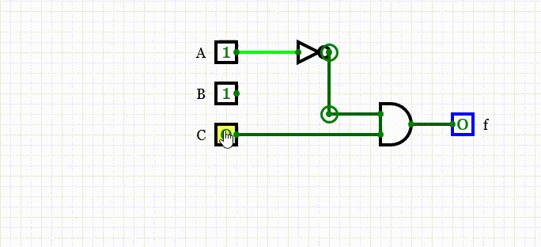

# Understanding Error Messages
 
1. **Bit Width Error X and Y**: If a wire connects two components demanding different bit widths (one input pin is placing X bits on the wire and another end of the wire is placing a Y bit), the multi-bit wire turns red or black while displaying this message on the simulator.

**Resolution:** Adjust the bit width value of the circuit elements  on either end of the wire to establish compatibility of the bit widths.

2. **Stimulation stack limit exceeded**: May be due to cyclic paths or contention.

**Resolution**: Cyclic paths cause an infinite loop and the circuit never reaches a stable state. Sometimes contention in wires presents itself as a cyclic path. Revise your circuit design for circuit nodes that sometimes behave as inputs and sometimes behave as outputs. Alternatively, troubleshoot and resolve the bug in the circuit.

2. **Contention Error 1 and 0**: When the circuit is driven by two or more outputs of both HIGH and LOW, the simulator may display this error.Refer figure 9.3 and 9.4.

   

   
<em>Figure 9.3</em>

    

   
<em>Figure 9.4</em>

**Resolution:** Logic contention errors indicate a circuit design problem leading to large amounts of power to flow across circuit elements. Revisit your design for some wiring errors or for active multiple output enable lines that are driving a bus or circuit node simultaneously.
