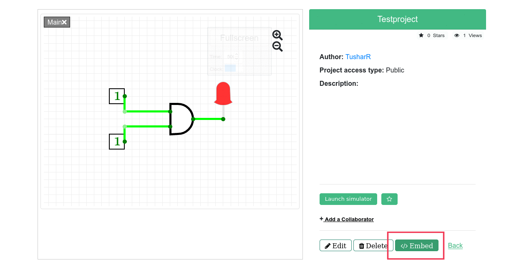

# Embedding Circuits

Contributing Authors: [@satu0king](https://github.com/satu0king/)

This section is a helpful step-by-step guide for educators to embed circuit in a webpage or presentation. Since CircuitVerse uses HTML5, the live circuit can be loaded in potentially a lot of places.

## Embedding in Google Slides

CircuitVerse supports embedding of live circuit in a Google Slides presentation. This will enable educators to teach by interacting with the circuit without leaving the presentation.

Google Slides itself doesn't natively support live circuits. Therefore, the following tools needs to be installed: 

### Installation instructions
#### Step 1: Install Browser Extension

The first step is to install the browser extension. Google Chrome and Firefox are currently supported. Safari support is coming soon.

1. [Chrome Extension](https://github.com/CircuitVerse/CircuitVerse-Presentation-Embed#chrome)
2. [Firefox Extension](https://github.com/CircuitVerse/CircuitVerse-Presentation-Embed#firefox)

##### Test if installation worked (optional)
1. Goto to the following Google Slides presentation: https://docs.google.com/presentation/d/1QybVSk8CujyHEHlLDtdlCiae9vK9qGhWfb4SA-WGCR0/edit#slide=id.g36e2028529a5eb1_0
2. Goto presentation mode. Live Circuits should load.

#### Step 2: Install Google Slides Add on

Install Google Slides Add on from [here](https://github.com/CircuitVerse/CircuitVerse-Presentation-Embed#installation-google-docs-add---on)

### Usage Instructions

#### Step 1: Open CircuitVerse Menu Side Bar
If the menu option is not available then the Google Slides Add On is not installed correctly.

#### Step 2: Insert a Circuit
1. Find the circuit you want to embed
2. Ensure the circuit is public
3. Enter the URL and click embed

Note: Any Circuit page will work

#### Step 3: Position the circuit image as per your requirements

The inserted circuit is an image with a hyperlink. This image can be resized, moved or duplicated just like a regular image. Care needs to be taken that the hyperlink is not removed.

#### Step 4: Launch presentation mode
Goto presentation mode. The live circuits are loaded automatically. 

## Embedding in a Webpage

These circuits can be embedded anywhere (apart from the documentation) since they utilize `iframe` HTML tag generated from the Circuitverse [website](https://circuitverse.org/)).

#### Getting the Embed code

a) To embed your circuit first go to "My Circuits" 

b) Select the circuit you want to embed and click on "More"

c) Click on "Embed."

d) You will now get the embed code for your circuit. The code is copied to your clipboard by default.

> The same process is true for any other circuits. 

#### Using the Embed code

In order to embed the circuit into documentation/any other webpage simply paste the embed code on the part of the web page you want it to be displayed. 

You now should be able to see the circuit with "Made with CircuitVerse" watermark:

<iframe width="600px" height="400px" src="https://circuitverse.org/simulator/embed/109920" id="projectPreview" scrolling="no" webkitAllowFullScreen mozAllowFullScreen allowFullScreen></iframe>

