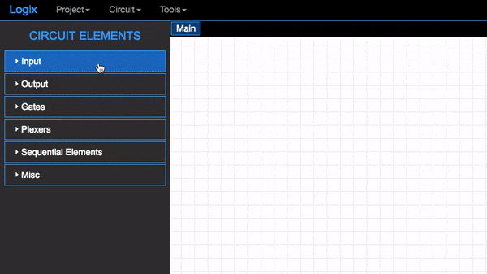
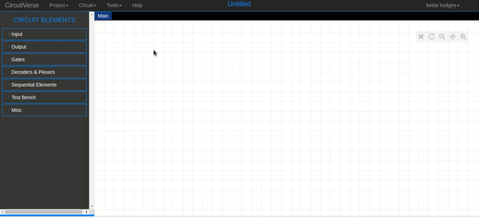
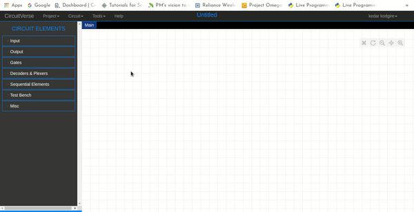
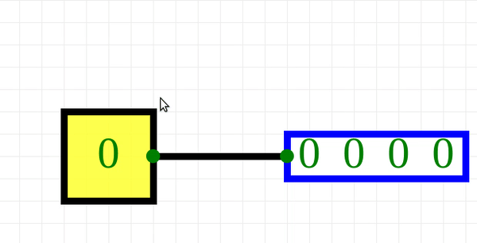

# Input Elements

>This Guide will help you understand the input elements in the CircutVerse [simulator](https://circuitverse.org/simulator) and their usage.

Contributing Authors: [@Kedar-K](https://github.com/Kedar-K)

## contents

* [Getting started](#getting-started)
* [Input](#input)
* [Button](#button)
* [Power](#power)
* [Ground](#ground)
* [Constantval](#constantval)
* [Stepper](#stepper)
* [Counter](#counter)

## Getting Started

For using the input elements, click on the *Input* on the top left corner. Once this expands, you will get all the input elements available to use.

Once all the components are visible, they can be used by dragging and dropping it on to the canvas like shown below:

## Input

The input to any gate or circuit can be high or low i.e (1) or (0). Here in the circuit Verse [simulator](https://circuitverse.org/simulator), to use the component, it needs to be dragged to the canvas as [above](#getting-started)
to use it. To change the Input state, the component needs to be clicked once as shown in the below image.

The example below is **Multi-Input And Gate**. Try to manipulate this example to understand the usage of the input component properly. The output of the gate will be 1 when all the three inputs are 1.

    <iframe width="500px" height="400px" src="https://circuitverse.org/simulator/embed/11920" id="projectPreview" scrolling="no" webkitAllowFullScreen mozAllowFullScreen allowFullScreen> </iframe>

## Button

A push-Button or simply a **Button** is a simple switch mechanism for controlling the output of the circuit. This component can be used by simple drag and drop process, it acts as High(1) when pressed and Low(0) when released.

    <iframe width="500px" height="400px" src="https://circuitverse.org/simulator/embed/11912" id="projectPreview" scrolling="no" webkitAllowFullScreen mozAllowFullScreen allowFullScreen> </iframe>

The example above shows the usage of the button. The circuit consists of AND gate, inputs to this AND gate are button and high(1) bit. The output is a digital LED. The LED will glow when the button is pressed as the button acts as high(1) when pressed.

## Power

Power is a component in the circuit design which is always High(1). This component should be used when there is a need for Input to be always High.

    <iframe width="500px" height="400px" src="https://circuitverse.org/simulator/embed/9554" id="projectPreview" scrolling="no" webkitAllowFullScreen mozAllowFullScreen allowFullScreen> </iframe>

The example above has LED's arranged in the form of "HI". These LED's will always glow as they are all connected to power.

## Ground

Occasionally, particularly in AC power distribution and some radio antenna systems, it does mean "a connection to the earth".

However, in most electronics, particularly portable battery-operated devices, "ground" is just the point in the circuit that the designer chooses to call "zero volts" and to use as a reference when measuring voltages elsewhere in the circuit. Hence, it is just similar to power but always Low(0).

## ConstantVal

The ConstantVal component can be used when there is a need to input some constant value instead of 0 and 1. This can be done by dragging and dropping the component on the board.

The value of ConstantVal can be changed by double-clicking the component and entering the value in the prompt.

## Stepper

The stepper can be used by dragging and dropping the component as shown [here](#getting-started).

Once the component is on the canvas, the value of the component can either be increased or decreased by pressing "+" key to increase and "-" key to decrease the value step by step after selecting the component.

## Random

The random component generates a random value in the range 0 to MaxValue every time it receives a high signal
from the clock. It has 3 ports in total:

* Max Value: input, maximum value generated.
* Clock: input clock element, every time the clock gets high the random elements generates a number.
* Random Value: output, the number generated

The value is also displayed in decimal notation on the random element.

<iframe width="600px" height="400px" src="https://circuitverse.org/simulator/embed/12041" id="projectPreview" scrolling="no" webkitAllowFullScreen mozAllowFullScreen allowFullScreen> </iframe>

## Counter

The counter component can be used by dragging it on to the canvas. It is a binary counter from zero to a specified maximum value. It has 5 ports in total i.e

* Max Value: input, maximum value that the counter will reach.
* Clock: input clock element, every time the clock gets high the counter increments by one.
* Reset: input, when high it resets the counter to zero.
* Zero: output, it's high when the counter is zero.
* Value: output, value of the counter in binary.

The value is also displayed in decimal notation on the counter element.

<iframe width="500px" height="400px" src="https://circuitverse.org/simulator/embed/12036" id="projectPreview" scrolling="no" webkitAllowFullScreen mozAllowFullScreen allowFullScreen> </iframe>
