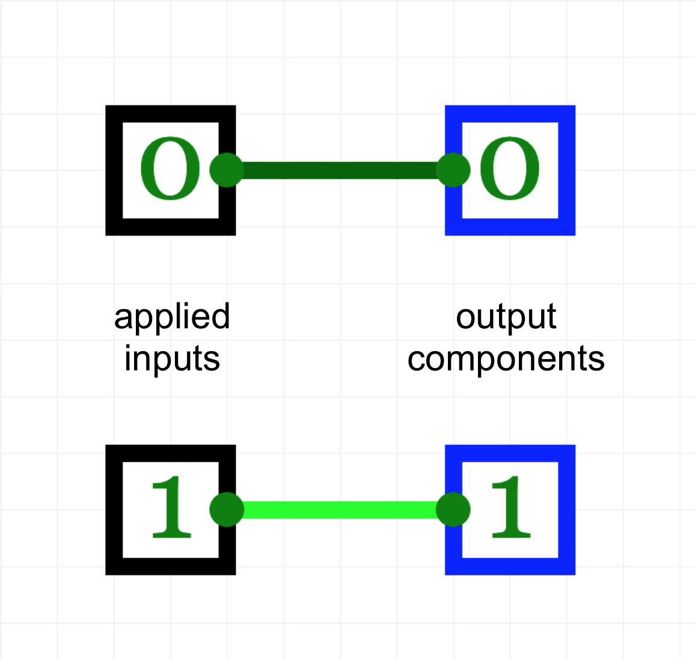
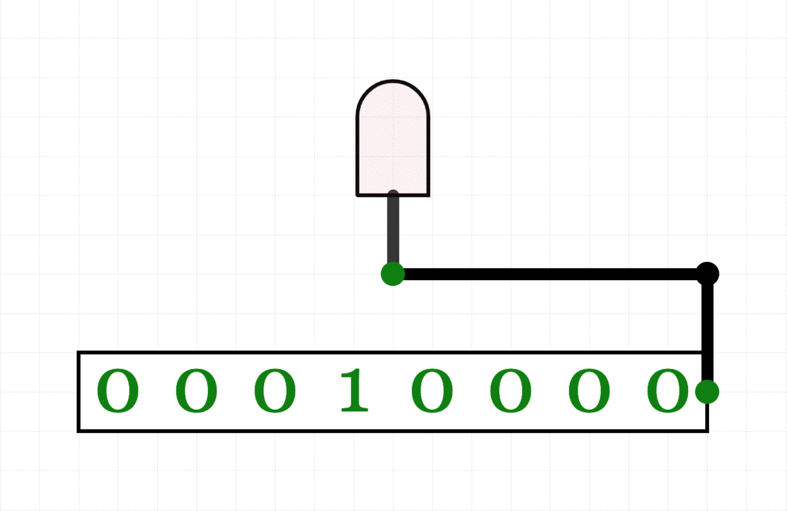

# Output Components

CircuitVerse features a eight output components:
* [Output](#output)
* [Digital LED](#digital-led)
* [Variable LED](#variable-led)
* [RGB LED](#rgb-led)
* [Square RGB LED](#square-rgb-led)
* [Hex Display](#hex-display)
* [Seven Segment Display](#seven-segment-display)
* [Sixteen Segment Display](#sixteen-segment-display)

This guide will explain how and when to use each of these components and provide some tips and tricks for doing so.

## Output
Output is the most simple output component. When connected to an input, it simply displays this input applied to it as a 0 or a 1.

## Digital LED
The digital LED component is rather similar in principle to the basic output component in that it switches between two states depending on the applied input. However, instead of just displaying a 0 or a 1, the LED turns off when the applied input is 0 and on when the applied input is 1.

## Variable LED
The variable LED component changes between 256 intensities based on an 8 bit input. It has a maximum intensity when the input applied is `11111111` and zero intensity when the input applied is `00000000`.

## RGB LED
Unlike the digital or variable LEDs, the RGB (red-green-blue) LED component can display a wide variety of colors. It takes three 8 bit inputs which describe the intensity of red, green, and blue color respectively. 

If you want to display a certain color, the easiest way to find what the inputs need to be is to use a [color picker](https://htmlcolorcodes.com/color-picker/) to find the corresponding R, G, and B values and then use a [decimal-to-binary converter](https://codebeautify.org/decimal-binary-converter) (or do it manually for the math practice) to find the 8 bit value that you need to enter for each input.

## Square RGB LED
The square RGB LED is quite similar to the regular RGB LED, save the difference in shape. The main advantage to using this type of LED is that it allows you to simulate pixels more easily.

## Hex Display
The hex display takes a 4 bit input and can display the integers 1 through 9 and the letters A through F. The input bits do not actually control the individual segments (it would not be possible to completely control six segments with only four bits), but rather it recognizes the integer/letter that a given input corresponds to and displays this character without the need for any programming of what exactly that character should look like on the display.

This display is more simple to use than the seven segment and sixteen segment display. However, it has less room for customization and can only display the first six letters of the alphabet.

## Seven Segment Display
The seven segment display takes in eight inputs and displays the output on the screen, usually representing a number. The top four inputs correspond to the middle, top left, top, and top right segments from left to right respectively. The bottom four inputs correspond to the bottom left, bottom, bottom right, and decimal segments from left to right respectively.

A common use of the seven segment display is to display an integer from 1 to 9. You could manually use AND and OR gates to accomplish this, but there is a much easier way! Go to tools > combinational analysis to create a truth table that will allow you to simply input the binary equivalent of the integer you want to display and have it display it for you. For a more complete explanation of how to do this, take a look at this [video](https://www.youtube.com/watch?v=EqxCBW0lMVQ).

## Sixteen Segment Display
The sixteen segment display takes two inputs and a total of 17 bits: 16 bits in the top input and 1 bit in the bottom input. The each of the 16 bits applied to the top input correspond to a certain segment in the sixteen segment display. The single bit applied to the bottom input controls the decimal point. 

There are both advantages and disadvantages to using the sixteen segment display as opposed to the hex and seven segment displays. The main advantage is that the greater number of segments allow you to create more detailed and clear numbers and letters. However, it requires double the input of the seven segment display and quadruple the input of the hex display, so it is significantly more complicated to work with.