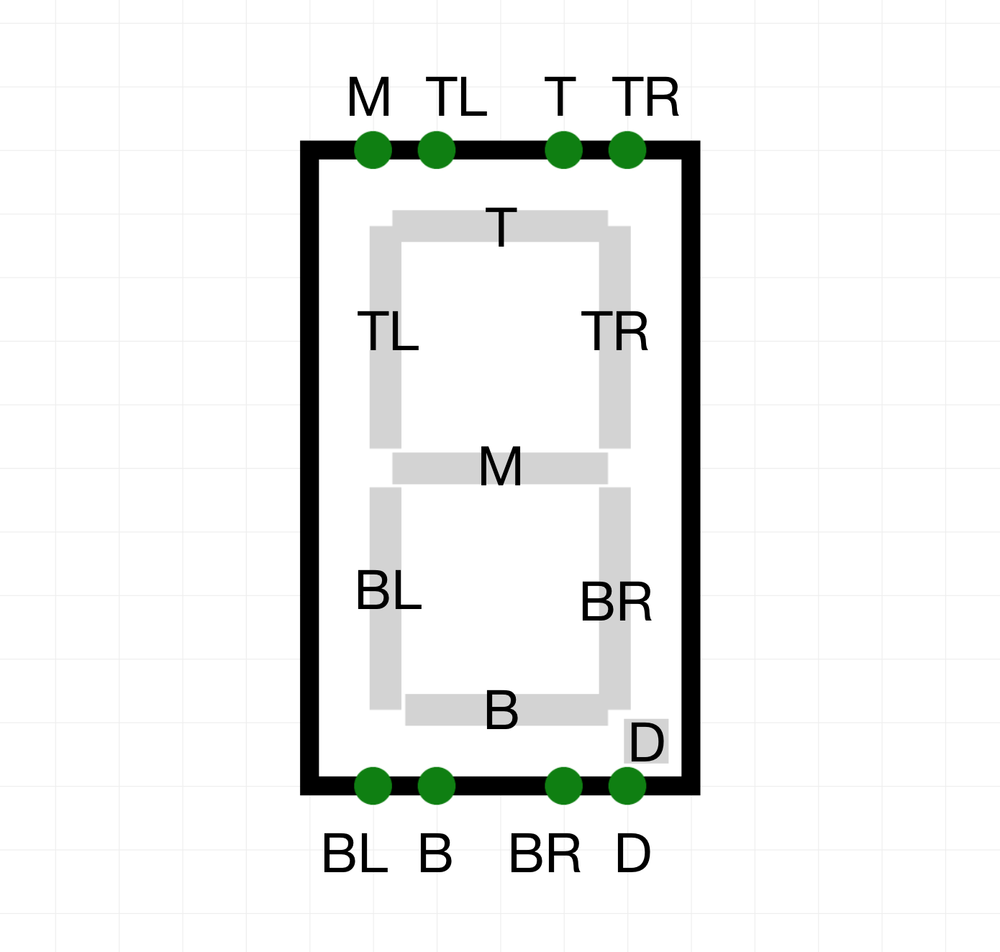
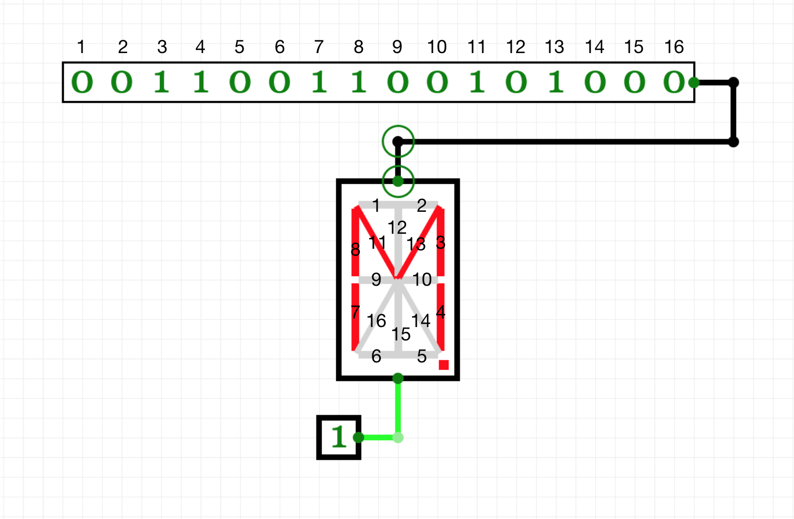

# Output Elements
Contributing Authors: [@SarahBornais](https://github.com/SarahBornais/)

CircuitVerse features a eight output elements:
* [Output](#output)
* [Digital LED](#digital-led)
* [Variable LED](#variable-led)
* [RGB LED](#rgb-led)
* [Square RGB LED](#square-rgb-led)
* [Hex Display](#hex-display)
* [Seven Segment Display](#seven-segment-display)
* [Sixteen Segment Display](#sixteen-segment-display)

This guide will explain how and when to use each of these elements and provide some tips and tricks for doing so.

## Output
Output is the most simple output element. When connected to an input, it simply displays the input applied to it in binary form. 

<iframe width="600px" height="400px" src="https://circuitverse.org/simulator/embed/11294" id="projectPreview" scrolling="no" webkitAllowFullScreen mozAllowFullScreen allowFullScreen> </iframe>

Output can display different bitwidths depending on your requirements. To display a different bitwidth, specify the bitwidth that you wish to display in the [properties menu](getting_started.md#property-menu) of the output element.

## Digital LED
The digital LED element switches between on and off depending on the input applied to it. An applied input of `1` corresponds to the LED turning on and an applied input of `0` corresponds to the LED turning off. The digital LED does not recognize inputs of a length other than one bit. 

<iframe width="600px" height="400px" src="https://circuitverse.org/simulator/embed/11304" id="projectPreview" scrolling="no" webkitAllowFullScreen mozAllowFullScreen allowFullScreen> </iframe>

Note that you can change the color of the LED manually in the [properties menu](getting_started.md#property-menu), but if you want the color to change based on the applied input, consider using the [RGB LED element](#rgb-led). 

## Variable LED
The variable LED element changes between 256 intensities based on an 8-bit input. It has a maximum intensity when the input applied is `11111111` and zero intensity when the input applied is `00000000`.

<iframe width="600px" height="400px" src="https://circuitverse.org/simulator/embed/11308" id="projectPreview" scrolling="no" webkitAllowFullScreen mozAllowFullScreen allowFullScreen> </iframe>

## RGB LED
Unlike the digital or variable LEDs, the RGB (red-green-blue) LED element can display a wide variety of colors. It takes three 8-bit inputs which describe the intensity of red, green, and blue color respectively. 

<iframe width="600px" height="400px" src="https://circuitverse.org/simulator/embed/11292" id="projectPreview" scrolling="no" webkitAllowFullScreen mozAllowFullScreen allowFullScreen> </iframe>

If you want to display a certain color, the easiest way to find what the inputs need to be is to use a [color picker](https://htmlcolorcodes.com/color-picker/) to find the corresponding R, G, and B values and then use a [decimal-to-binary converter](https://codebeautify.org/decimal-binary-converter) (or do it manually for the math practice) to find the 8-bit value that you need to enter for each input.

## Square RGB LED
The square RGB LED is quite similar to the regular RGB LED when it comes to displaying colors. However, it differs in its shape as well as in the fact that you can vary its pin lengths in the [properties menu](getting_started.md#property-menu). Both of these additional features make square RGB LEDs ideal for simulating arrays of pixels.

<iframe width="600px" height="400px" src="https://circuitverse.org/simulator/embed/11345" id="projectPreview" scrolling="no" webkitAllowFullScreen mozAllowFullScreen allowFullScreen> </iframe>

This example illustrates how an array of pixels may be programmed to display an image. Here, "LED Buffer" [subcircuits](subcircuit.md) were used to ensure that the circuitry controlling the LEDs did not become too confusing or overwhelming to read. We recommend that you also use subcircuits when creating your square RGB LED projects. 

As you can see, the ability to vary the pin length of the square RGB LEDs can be quite useful to create clean, easy to read circuits. However, it is crucial that you ensure that when you change the pin lengths, the pins of LEDs remain in the same vertical order as the LEDs themselves (i.e. the top pins correspond to the top LED). If you do not do this, you will find programming your square RGB LED projects to be rather confusing and frustrating.

## Hex Display
The hex display takes a 4-bit input and can display the integers 1 through 9 and the letters A through F. The input bits do not actually control the individual segments (it would not be possible to completely control six segments with only four bits), but rather the hex display recognizes the integer/letter that a given input corresponds to and displays this character without the need for any programming of what exactly that character should look like on the display.

<iframe width="600px" height="400px" src="https://circuitverse.org/simulator/embed/11311" id="projectPreview" scrolling="no" webkitAllowFullScreen mozAllowFullScreen allowFullScreen> </iframe>

This display is more simple to use than the seven segment and sixteen segment display and is great for displaying basic integers. However, it has less room for customization and can only display the first six letters of the alphabet.

## Seven Segment Display
The seven segment display takes in eight inputs and displays the output on the screen, usually representing a number. The top four inputs correspond to the middle, top left, top, and top right segments from left to right respectively. The bottom four inputs correspond to the bottom left, bottom, bottom right, and decimal segments from left to right respectively.

You can test out different inputs for yourself:
<iframe width="600px" height="400px" src="https://circuitverse.org/simulator/embed/11316" id="projectPreview" scrolling="no" webkitAllowFullScreen mozAllowFullScreen allowFullScreen> </iframe>

A common use of the seven segment display is to display an integer from 1 to 9. You could manually use AND and OR gates to accomplish this, but there is a much easier way! Go to tools > combinational analysis to create a truth table that will allow you to simply input the binary equivalent of the integer you want to display and have the generated circuit display it for you. For a more complete explanation of how to do this, take a look at [this video](https://www.youtube.com/watch?v=EqxCBW0lMVQ).

The seven segment display is quite similar to the hex display, but the fact that it takes 8-bit input rather than 4-bit input makes it significantly more customizable. However, the larger input also makes it more complicated to work with.

## Sixteen Segment Display
The sixteen segment display takes two inputs and a total of 17 bits: 16 bits in the top input and 1 bit in the bottom input. Each of the 16-bits applied to the top input corresponds to a certain segment in the sixteen segment display. The single bit applied to the bottom input controls the decimal point. 

You can test out different inputs for yourself:
<iframe width="600px" height="400px" src="https://circuitverse.org/simulator/embed/11319" id="projectPreview" scrolling="no" webkitAllowFullScreen mozAllowFullScreen allowFullScreen> </iframe>

There are both advantages and disadvantages to using the sixteen segment display as opposed to the hex and seven segment displays. The main advantage is that the greater number of segments allow you to create more detailed and clear numbers and letters. However, it requires double the input of the seven segment display and quadruple the input of the hex display, so it is significantly more complicated to work with.
