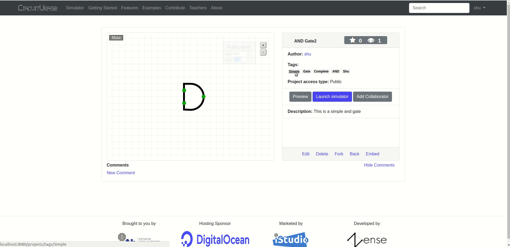
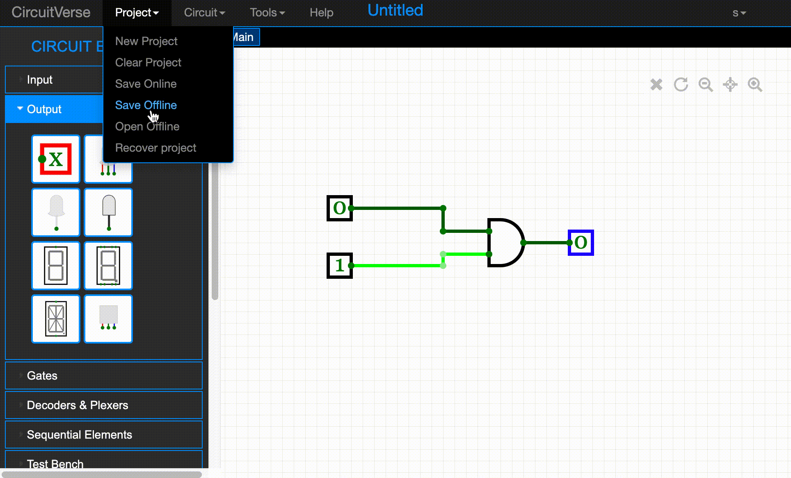

# Saving Projects

> CircuitVerse allows the users to save their projects both online as well as offline.

Contributing Authors: [@amansingla97](https://github.com/amansingla97/)
## Save Online
This option allows the user to save their project with the CircuitVerse cloud. While saving the project the user can also provide a description along with relevant tags related to the project.
The project can also be saved with public, private or limited access.

#### Tags
Tags are used to categorize projects. Tags work like keywords or labels that make it easy to organize a project.
A project can be related to one or multiple tags separated by a comma.
With one click on any tag, the user can search the related tagged projects.

## Save Offline

This option allows the user to save the project in the browser's local storage when there is no internet access. On an active Internet connection, the user is prompted to save it to the CircuitVerse cloud.

