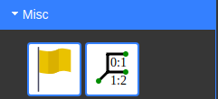
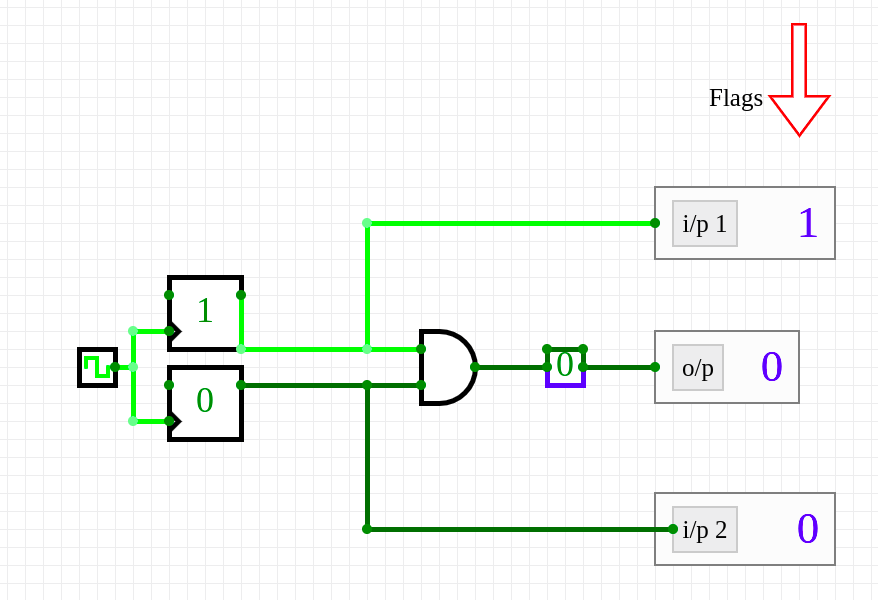
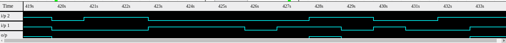
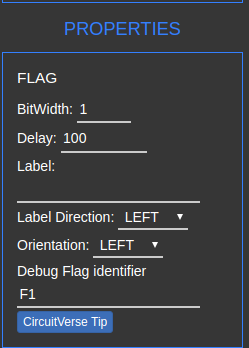

# Visualization of Timing Diagrams 

> This guide will teach you how to visualize the timing diagram with the help of flags in CircuitVerse

Contributing Authors: [@theredcap](https:github.com/theredcap)

Timing plays a vital role while you are designing any circuit. Timing diagrams help us visualize the state of different signals with respect to time.  In a timing diagram, time is represented on the x-axis and the different components or signals of the system, that interact with each other, are represented on the y-axis. 

#### Using Flags

To visualize the timing diagram of different signals of your circuit in [CircuitVerse](https://circuitverse.org/simulator), you can take the help of the circuit element called Flag, which is present on the Misc section.

Attach the flag to the signal that you want to visualize.

You will now see the visualizer at the bottom of your screen, which shows the timing diagram of the various signals you have attached  the flag to.

#### Changing the name of the Flag

By default the flags are named as F1, F2 and so on. This can be confusing when you are dealing with a lot of signals. To change the name of the flag:

1. Click on the flag

2. Locate Properties ribbon that appears at the bottom left corner of the page

   

3. Change the default name present on the Debug Flag Identifier to the name you desire.

   

