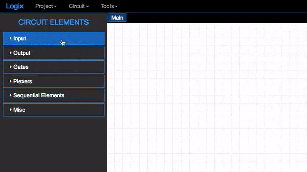

# Input Elements

>This Guide will help you to understand the input elements in the CircutVerse [simulator](https://circuitverse.org/simulator) and their usage.

## contents

* [Getting started](#getting-started)
* [Input](input)
* [Button](#button)
* [Power](#power)
* [Ground](#ground)
* [Constantval](#constantval)
* [Stepper](#stepper)

## Getting Started

For the input elements just click on the *Input* on the top left corner. Once this expands you will get all the Input elements available to use.

Once You get all the options you just need to select and drag the element that you need to the canvas like this:

## Input

The input to any gate or any circuit can be high or low i.e (1) or (0). Here in the circuit Verse [simulator](https://circuitverse.org/simulator), you can just drag the input component from the input section as shown [above](#getting-started)
to use it. To change the Input state you just need to click on the input component.
_

    <iframe width="400px" height="400px" src="https://circuitverse.org/simulator/embed/735" id="projectPreview" scrolling="no" webkitAllowFullScreen mozAllowFullScreen allowFullScreen></iframe>

In the example above which is **Multi-Input And Gate** you can try changing the input states as per the above instructions.

## Button

A push-Button or simply a **Button** is a simple switch mechanism for controlling some aspect or process. You can use this by simple drag and drop process, it acts as High(1) when pressed and Low(0) when released.

    <iframe width="400px" height="400px" src="https://circuitverse.org/simulator/embed/2520" id="projectPreview" scrolling="no" webkitAllowFullScreen mozAllowFullScreen allowFullScreen> </iframe>

The example shown above is **Manual Traffic Light** and it uses the buttons, you can interact with this example by pressing the buttons and see the output.

## Power

Power is a component in the circuit design which is always High(1). You should use this component when you need your Input to be High always.

    <iframe width="500px" height="400px" src="https://circuitverse.org/simulator/embed/9554" id="projectPreview" scrolling="no" webkitAllowFullScreen mozAllowFullScreen allowFullScreen> </iframe>

You can see in the above example that the power is connected to the LED, hence it is always on.

## Ground

 Occasionally, particularly in AC power distribution and some radio antenna systems, it does mean "a connection to the earth".

However, in most electronics, particularly portable battery-operated devices, "ground" is just the point in the circuit that the designer chose to call "zero volts" and to use as a reference when measuring voltages elsewhere in the circuit. Hence it is just simillar to the power but always Low(0).

## ConstantVal

You can use the ConstantVal component when you want to input some constants of your choice instead of 0 and 1 by dragging and dropping it on the board.You can change the value of this component by double clicking on it which gives you dialog box with input section in it where you can enter your constants.

    <iframe width="500px" height="400px" src="https://circuitverse.org/simulator/embed/9470" id="projectPreview" scrolling="no" webkitAllowFullScreen mozAllowFullScreen allowFullScreen> </iframe>

You can manipulate the above example to see the difference between the Input and ConstantVal and their usage.

## Stepper

The stepper can be used by deagging and dropping the component as shown [above](#getting-started).

Once you drag and drop the element then the value of the stepper can be changed by selecting the component by clicking on it and press (+) or (-) on your keyboard to increase or decrease the value.